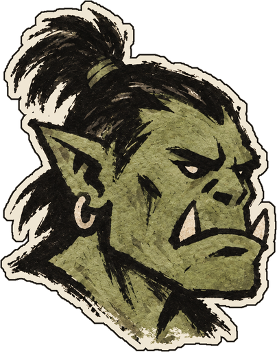

<p align="center">
  
</p>

<h1 align="center">Orchraft</h1>

<p align="center">
  <strong>Never write a branch name, commit message, or PR description by hand again.</strong><br>
  <em>Nothing touches git until you say go, chief.</em>
</p>

<p align="center">
  <a href="https://github.com/karloows/orchraft/actions/workflows/validate-plugin.yaml"></a>
  
  
  <a href="LICENSE"></a>
</p>

The orc talks back. Here's an illustrative exchange, start to finish:

```text
chief ▸ the login crashes on a null token — fix it

orc   ▸ We read before we swing: the guard was missing in
        src/auth/session.ts. Patched it.
        Validation: `npm test -- auth` → passed.

        Nothing committed. Say the word when you want it shipped.

chief ▸ ship it

orc   ▸ 🚢 Grah! War party launched. PR #123 holds the beach for review, chief. ✨

        Branch: `fix/login-null-token`
        Commit: `fix(auth): guard null login token`
        PR: https://github.com/example/repo/pull/123
        Validation: `npm test -- auth`
```

You already write the fix. Then comes the part nobody enjoys: naming the
branch, writing the commit, drafting the PR description, remembering what's
still open. That's the chore orchraft hauls — grounded in your repo's real
diff and history, not invented, and nothing touches git or GitHub until you
say go. Built first for the solo dev with no one else to hand the busywork
to.

The name joins *orchestration* and *craft*. The orc does the crafting.

<p align="center">
  
</p>

## Clan Laws

- **The chief decides.** No commit, push, merge, or PR comment happens without
  your go-ahead in the current turn, by default
  (`context/policies/approval-policy.md`). Opt into `Autonomous Mode` there if
  you want routine mutations pre-authorized — merge, force-push, delete, and
  issue close/reopen stay gated either way.
- **Your stronghold, your rules.** We read your project's policies, templates,
  and CI config first. Our bundled policies are only defaults.
- **No bluffing.** Branch names, commits, reviews, and explanations come from
  the real diff, history, and docs.
- **Any stack.** No assumptions about language, CI provider, or hosting.

## The War Band So Far

Each skill is one tool in the clan's kit. These are forged today; more are on
the anvil as we cover the rest of the lifecycle.

| Skill | Clan role | What it does |
| --- | --- | --- |
| `warplan` | 🗺️ Tactician | Drafts an implementation plan grounded in this repo's own conventions and precedent before any code is written. |
| `quest` | 📌 Quest-Giver | Triages, creates, or updates a GitHub issue before implementation starts. |
| `ship` | 🚢 Raid Captain | Creates a policy-compliant branch, commit, push, and pull request from the actual diff. |
| `roast` | 🔥 Trialmaster | Reviews the pull request against your repo's policies and posts findings as inline comments with fixes and copy-paste AI prompts. |
| `land` | 🏰 Haulmaster | Checks mergeability and CI, merges with the method your repository allows or your config names, syncs the base branch, and cleans up the branch. |
| `yap` | 🗣️ Scout | Explains a PR, file, error, policy, or dependency, citing real sources instead of guessing. Read-only. |
| `lore` | 📜 Loremaster | Adds or fixes code comments and docstrings across a diff, file, or PR to match your repo's lore policy. |
| `chronicle` | 📚 Chronicler | Drafts or updates standalone Markdown docs — feature write-ups, design docs, README/ROADMAP sections — grounded in the real diff, code, or history. |
| `runes` | 📖 Rune-Reader | Summarizes the live state of a branch, PR, checks, and standing review findings. Read-only. |
| `reckoning` | 🗂️ Reckoner | Lists every review finding consciously declined rather than fixed, across the whole repo's pull requests. Read-only. |
| `plunder` | 💰 Quartermaster | Reports real repo-wide shipping signal — PRs opened, findings roast caught and their fixed/declined fate, time-to-land. Read-only. |
| `muster` | 🧭 Warden | Reports actionable open-PR state — failing/pending checks, merge conflicts, unresolved review threads — across every repo you own. Read-only. |
| `herald` | 📯 Herald | Drafts release notes from the pull requests actually merged, plus any commit pushed straight to the base branch, then writes them into the GitHub release once you approve. |
| `warchief` | ⚔️ War Council | Chooses the next lifecycle role without treating orchestration as approval for mutations. |
| `watchtower` | 👁️ Watchtower | Surfaces a short read-only nudge about actionable PR state. |

Today's march is `warplan` → `quest` → `lore` → `chronicle` → `ship` →
`roast` → fix → `ship` → `land` → `herald`, with `yap` available at any
point.

## What A March Looks Like

Asking for a fix gets you the fix and nothing more, as in the example at the
top of this page. Asking to ship is what sends it: `ship it` in the current
turn authorizes that whole run — branch, commit, push, and pull request.

The gate sits between the work and git, not inside `ship`: a request to fix,
address, or resolve something is approval to edit, never to commit. It does
not carry forward either — the next push to that branch needs the word again.
`roast` posts no review, `land` merges nothing, and `quest` closes no issue
until you say so.

## Status

Stable enough to build on. The public surface is the skill names, the policy
filenames and what they promise, and the `.orchraft.jsonc` keys — a breaking
change to any of those comes with a major version bump, so an upgrade never
moves the ground under an installed copy.

## Requirements

- Local `git` and file access — enough for `lore` and `chronicle` on a diff
  or file, and for `warchief`, which routes to the right skill without
  reading GitHub state itself.
- A GitHub MCP connector configured for the session, authenticated with
  write access (not just read) for `ship`, `roast`, `land`, and `quest` —
  they create/update pull requests, post reviews, merge, and manage issues.
  `gh` installed and authenticated works as a fallback when the MCP
  connector is unavailable mid-session.
- `gh` with write access for `herald` to publish release notes, since the
  GitHub MCP connector can't write releases. Drafting them needs only read
  access.
- Read-only GitHub access is enough for `runes`, `reckoning`,
  `plunder`, `watchtower`, `yap`, and `warplan` when they're only
  reading PR/issue state, not changing it.
- `gh` installed and authenticated for `muster`, specifically — it enumerates
  every repo you own via `gh api user/repos`, which no MCP tool in this
  session exposes directly. Read-only access is enough; it never writes.
- `jq` for the two ambient hooks (`watchtower-nudge.sh` and
  `main-commit-nudge.sh`) to parse their JSON input — both degrade to
  silence, not an error, when it's missing.

## Layout

- `skills/`: canonical agent skills, read directly by Claude Code, Codex, and
  Grok Build once orchraft is installed — no per-ecosystem symlink layer.
- `.claude-plugin/`: Claude Code plugin manifest and marketplace.
- `.codex-plugin/` and `.agents/plugins/marketplace.json`: Codex CLI plugin
  manifest and marketplace, reading the same `skills/`.
- `.grok-plugin/`: Grok Build plugin marketplace, reading the same
  `skills/`.
- `hooks/`: a `SessionStart` hook that runs `watchtower`'s status checks
  automatically (a plain script, not a model call) so the nudge shows up
  without asking for it, and a `PreToolUse` hook that nudges — never
  blocks — when a `git commit`/`push` is about to run directly against the
  repository's default branch. The only ambient behaviors here — every
  other skill is invoked on purpose.
- `context/policies/`: reusable approval, branch, commit, config, lore,
  docs, review, and PR writing policies.
- `.orchraft.example.jsonc`: a starting point holding every setting at its
  default, with the accepted values in comments. Copy it to
  `.orchraft.jsonc` (or `.orchraft.json`) and edit what you want to change;
  `context/policies/config-policy.md` documents each setting and how it
  ranks against your repository's own settings. Optional — the skills work
  with no config file at all.
- `context/personality.md`: the orc's character and voice, and where it
  applies.
- `evals/`: `claude plugin eval` cases that check skill behavior (e.g. `ship`
  refusing to commit without a request) rather than file syntax.
- `assets/`: art used by this README. `orc.png` is the mascot in the header,
  `orc-intro.svg` is the animated banner, and `orc-armor.png` is the original
  illustration that banner embeds — kept as the source of the artwork, not
  referenced directly by any page.

Edit the canonical skill files in `skills/` directly.

## Install As A Claude Code Plugin

```shell
/plugin marketplace add karloows/orchraft
/plugin install orchraft@orchraft
```

If the install reports that the plugin isn't active yet, run
`/reload-plugins` (or `/reload-plugins --force` if it warns about the prompt
cache).

The skills load as `/orchraft:warplan`, `/orchraft:quest`, `/orchraft:ship`,
`/orchraft:land`, `/orchraft:roast`, `/orchraft:yap`, `/orchraft:lore`,
`/orchraft:chronicle`, `/orchraft:runes`, `/orchraft:reckoning`,
`/orchraft:plunder`, `/orchraft:muster`, `/orchraft:herald`,
`/orchraft:warchief`, and `/orchraft:watchtower`. They read
`context/policies/` from your repo when present and fall back to the
policies bundled with the plugin.

To try a local checkout without installing, run
`claude --plugin-dir /path/to/orchraft`.

## Install As A Codex Plugin

```shell
codex plugin marketplace add karloows/orchraft && codex plugin add orchraft@orchraft
```

The skills load the same way as in Claude Code, from the same
`skills/` files, and read `context/policies/` from your repo the
same way.

## Install As A Grok Build Plugin

```shell
grok plugin marketplace add karloows/orchraft && grok plugin install orchraft --trust
```

The skills load the same way as in Claude Code and Codex, from the same
`skills/` files, and read `context/policies/` from your repo the
same way.

## First 60 Seconds

No command needed to see it work. As a plugin install, `watchtower`'s
`SessionStart` hook fires on your very next session start, resume, clear, or
compact in a repo with something actionable — an open PR with unresolved
`roast` findings, failing or pending checks, a clean PR ready for `land`, or a
local branch with uncommitted changes and no PR yet. It says nothing when
there's nothing worth interrupting for.

## Copy Into A Project

For other agents, or to customize the files, copy the parts you need into a
target project:

- `skills/` for the canonical `warplan`, `quest`, `ship`, `land`,
  `roast`, `yap`, `lore`, `chronicle`, `runes`, `reckoning`,
  `plunder`, `muster`, `herald`, `warchief`, and `watchtower` workflows.
- `context/policies/` for approval, branch, commit, lore, docs, review, and
  PR writing rules.
- `context/personality.md` for the orc voice the skills use in success lines.
- `hooks/hooks.json`, `hooks/watchtower-nudge.sh`, and
  `hooks/main-commit-nudge.sh` for the ambient `watchtower` nudge and the
  direct-to-default-branch commit/push nudge. This directory is only
  auto-discovered when loaded as a Claude Code plugin; outside that, copy
  all three files to `hooks/` at your project root and copy the `hooks`
  object from `hooks/hooks.json` into your own `.claude/settings.json`.
  Each command falls back from `${CLAUDE_PLUGIN_ROOT}` to
  `${CLAUDE_PROJECT_DIR}`, so it resolves either way without editing the
  path.

Copy `context/` together with the skills. The skills fall back to
`${CLAUDE_PLUGIN_ROOT}/context/` only when running as the plugin; outside it,
that path doesn't resolve.

Project-local instructions, PR templates, hooks, and CI checks should override
these defaults.

## Releases

Versioning and `CHANGELOG.md` are managed by
[release-please](https://github.com/googleapis/release-please). Merge the open
release PR to publish a new version; release-please writes the changelog
itself, so never edit `CHANGELOG.md` by hand.

## Star History

<a href="https://star-history.com/#karloows/orchraft&Date">
  <picture>
    <source media="(prefers-color-scheme: dark)" srcset="https://api.star-history.com/svg?repos=karloows/orchraft&type=Date&theme=dark" />
    
  </picture>
</a>

## License

Apache-2.0
